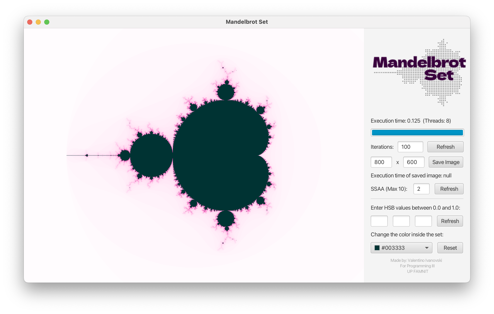

# mandelbrotset.v1
This is a project developed by Valentino Ivanovski for the Computer Science course Programming III, at UP FAMNIT in 2023.
## Setup JavaFx (Instructions only for IntelliJ Idea)
1. Download the "javafx-sdk-19" folder that's in the repository.
2. Open the project in IntelliJ Idea and head over to File –> Project Structure.
3. Click on Libraries and then on the little plus button at the top left, next to the sidebar.
4. Select Java and head over to where you've stored your "javafx-sdk-19" folder. Open it and head over to "lib". Inside, search for a file named javafx.swing. Add it as a library.
5. Next, you need to add the entire folder named "lib" as a library. Same process as above, just select the entire folder.
6. The program should be working now.
## Setup MPJ (Distributive in multicore mode)
1. Download Mpj Express
2. Import mpj.jar to the "untitled" project.
3. Set an $MPJ_HOME environmental variable to the mpj express folder.
4. Modify the path to the "src" folder of the "untitled" project on your machine on line 767 in myMandelbrot.java.
5. If running on Windows, change the "/" to "\" in paths.
## How the program looks:

  

## Exploring the Mandelbrot set:

  

